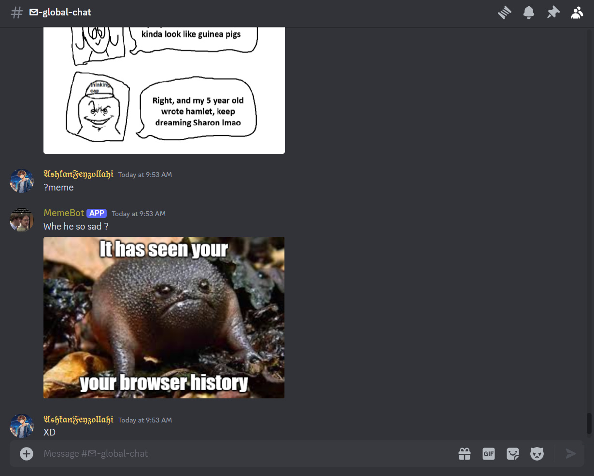

# Meme Bot: A Discord Bot That Generates and Sends Memes Using meme-api.com



MemeBot is a Discord bot designed to fetch memes from meme-api.com and distribute them across various Discord servers.

## Prerequisites

To get started with MemeBot, ensure the following tools are installed:

- Python: Version 3.10 or higher (preferably 3.11).
- PIP (Python package manager): The latest version.
- Git: The latest stable release.

## Setup Instructions

Follow the steps below to set up and use MemeBot:

### Step 1: Clone the Repository

Open your terminal or command prompt and type the following command to download the project files:

```bash
git clone https://github.com/AshkanFeyzollahi/meme-bot.git
```

### Step 2: Install Dependencies

Navigate to the newly created folder using the terminal or command prompt and install the required packages:

- For **Windows** Users:

    ```bash
    python -m pip install -r requirements.txt
    ```

- For **Linux** & **Mac OS** Users

    ```bash
    python3 -m pip install -r requirements.txt
    ```

### Step 3: Obtain Your Bot Token

Create a new bot application on the Discord Developer Portal, obtain its token, and save it for later use.

### Step 4: Configure Environment Variables

Create a new file named .env within the project folder and add the following line, replacing <YOUR_BOT_TOKEN> with your actual bot token:

BOT_TOKEN=<YOUR_BOT_TOKEN>
Save the file and exit the terminal or command prompt.

### Step 5: Run the Bot

Return to the terminal or command prompt in the project folder and execute the following command based on your operating system:

- For **Windows** Users

    ```bash
    python main.py
    ```

- For **Linux** & **Mac OS** Users

    ```bash
    python3 main.py
    ```

Upon successful execution, you should see a message similar to the following:

Logged in as ...#.... (ID: ...)
Now join your desired Discord server and test out the bot by sending the command ?meme. You should start receiving memes from MemeBot!

## Troubleshooting

Should you encounter any issues while setting up or using MemeBot, please consider opening an issue on GitHub detailing the problem. We'll be happy to help you resolve any difficulties you may face.
